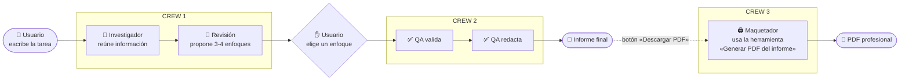

# 🏢 Oficina Multiagente con CrewAI

> **Demo 3** de la máster class [CrewAI: aprender a crear tus agentes](../README.md): la oficina multiagente de la
> [Demo técnica 1](../demo-tecnica-1/) ampliada con un **Agente Maquetador** que usa una **herramienta** para exportar el informe a PDF,
> y una interfaz renovada con robots animados.

Cuatro agentes de IA trabajan como un equipo de oficina. Tú les das una tarea, ellos investigan,
te proponen varios enfoques, **tú decides**, te entregan un informe y, si lo pides, un agente lo maqueta en **PDF**.
Todo se ve en directo en una oficina animada en el navegador.

## El flujo en una imagen



**¿Por qué dos crews?** Un crew de CrewAI se ejecuta de principio a fin sin parar.
Como queremos que una persona decida a mitad del proceso (*human-in-the-loop*),
lo partimos en dos: el Crew 1 termina con las opciones y el Crew 2 empieza con la elección.

## Los 3 conceptos de CrewAI

| Concepto | Qué es | En este proyecto |
|---|---|---|
| **Agent** | Quién trabaja: rol, objetivo, historia y modelo | Investigador, Revisión, QA |
| **Task** | Qué hay que hacer y qué resultado se espera | investigar, revisar, validar, redactar |
| **Crew** | El equipo que ejecuta las tareas en orden | Crew 1 (investigar + revisar), Crew 2 (QA) y Crew 3 (PDF) |
| **Tool** | Una función que el agente *decide* usar | El Maquetador usa «Generar PDF del informe» |

Dos detalles clave en `app/crew.py`:
- `context=[tarea_investigar]` → la tarea de revisión **recibe el resultado** del investigador.
- `output_pydantic=Revision` → el revisor devuelve **JSON estructurado** (opciones con título, pros, contras), que la web pinta como tarjetas.
- `tools=[HerramientaPDF(...)]` → el Maquetador decide el título y subtítulo y **llama a la herramienta**, que genera el PDF
  (portada, ficha del encargo, cuerpo, anexo, cabecera y «Página X de Y»). El informe se carga en la herramienta al crearla,
  así el LLM solo tiene que pasar dos argumentos cortos.

## Archivos

```
app/crew.py     ← ⭐ LOS AGENTES (lo importante de la clase)
app/herramientas.py ← la herramienta «Generar PDF del informe» (BaseTool + maquetación con ReportLab)
app/models.py   ← formato de las opciones del revisor
app/main.py     ← servidor web que conecta la oficina con los agentes
app/demo.py     ← simulación sin IA (para ensayar sin gastar)
static/index.html ← la oficina animada
```

## Cómo arrancarlo

1. Instala [Ollama](https://ollama.com), déjalo abierto y descarga el modelo: `ollama pull qwen2.5:7b`.
   (Opcional: copia `.env.example` a `.env` para cambiar de modelo, p. ej. `MODEL=ollama/llama3`,
   o usar Anthropic/OpenAI con su API key.)
2. Doble clic en **`iniciar.bat`** (o `.venv\Scripts\python -m uvicorn app.main:app`).
3. Abre http://localhost:8001

> Con `DEMO_MODE=1` (o si eliges Anthropic/OpenAI sin API key) arranca en **MODO DEMO**: los agentes se simulan.

## Qué verás en la oficina

| Fase | En pantalla |
|---|---|
| 1. Investigación | El Investigador teclea, su bocadillo muestra lo que piensa |
| 2. Revisión | Vuela un papel a Revisión; aparecen post-its en su pizarra |
| 3. Tu decisión | Suena la campana en *Tu mesa* y se abre un diálogo con las opciones |
| 4. QA | Tu elección vuela a QA, se enciende la impresora |
| 5. Informe | Sello **OK ✓ QA** y el informe aparece debajo |
| 6. PDF | Pulsa **Descargar PDF**: el Maquetador trabaja en el canal y se descarga el PDF |

A la derecha, el *Canal de la oficina* registra cada paso de cada agente.

## Guion sugerido para la clase (≈ 20 min)

1. **Demo primero** (3 min): lanza una tarea y deja que vean la oficina funcionar.
2. **Los agentes** (5 min): abre `app/crew.py`, PASO 1. Tres `Agent` = tres personas con rol y objetivo.
3. **Las tareas y el crew** (5 min): PASO 2. Enseña `context=` (pasar trabajo entre agentes) y `output_pydantic=`.
4. **El humano en el bucle** (4 min): PASO 3 y 4. Por qué partimos en dos crews.
5. **Preguntas / reto** (3 min): *¿Qué agente añadirías?* (p. ej. un Traductor o un Diseñador de gráficos).
